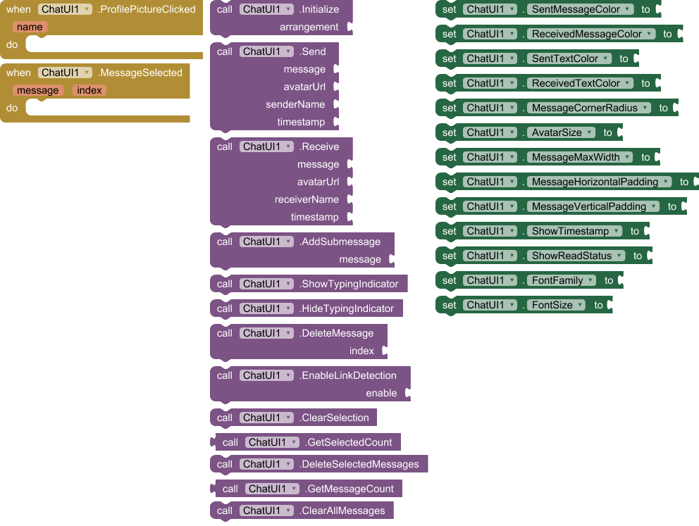
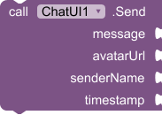
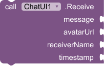

<h1><kbd>🧩 ChatUI</kbd></h1>
An extension for MIT App Inventor 2. 
Extension component for ChatUI. Created using Rush.

## 📝 Specifications

---

🔎 **Use Place:** An extension for MIT App Inventor 2, Kodular, Niotron, Android Builder.  
👤 **Author:** Created by: [white_tiger](https://community.appinventor.mit.edu/u/white_tiger/summary)  
📦 **Package:** com.xtiger.chatui  
💾 **Size:** 19.26 KB  
⚙️ **Version:** 2  
📱 **Minimum API Level:** 7  
📅 **Updated On:** [date=2025-07-15 timezone="Asia/Calcutta"]  
💻 **Built & documented using:** [FAST](https://community.appinventor.mit.edu/t/fast-an-efficient-way-to-build-publish-extensions/129103?u=jewel) <small><mark>v3.8.1</mark></small>  
⬇️ **Aix:** [Download Link](./out/com.xtiger.chatui.aix)  

## <kbd>Total Blocks of Extension:</kbd>

{width=90%}  

## <kbd>Events:</kbd>

**ChatUI** has total 2 events.

### 1. ProfilePictureClicked

  
Event raised when a profile picture is clicked

| Parameter | Type |
| --------- | ---- |
| name      | text |

### 2. MessageSelected

  
Event raised when a message is selected

| Parameter | Type   |
| --------- | ------ |
| message   | text   |
| index     | number |

## <kbd>Methods:</kbd>

**ChatUI** has total 13 methods.

### 1. Initialize

  
Initialize the chat UI in a VerticalArrangement

| Parameter   | Type      |
| ----------- | --------- |
| arrangement | component |

### 2. Send

  
Send a message

| Parameter  | Type |
| ---------- | ---- |
| message    | text |
| avatarUrl  | text |
| senderName | text |
| timestamp  | text |

### 3. Receive

  
Receive a message

| Parameter    | Type |
| ------------ | ---- |
| message      | text |
| avatarUrl    | text |
| receiverName | text |
| timestamp    | text |

### 4. AddSubmessage

  
Add a submessage to indicate someone joined the chat

| Parameter | Type |
| --------- | ---- |
| message   | text |

### 5. ShowTypingIndicator

  
Show typing indicator

### 6. HideTypingIndicator

  
Hide typing indicator

### 7. DeleteMessage

  
Delete a message by index (starting from 1)

| Parameter | Type   |
| --------- | ------ |
| index     | number |

### 8. EnableLinkDetection

  
Enable or disable link detection in messages

| Parameter | Type    |
| --------- | ------- |
| enable    | boolean |

### 9. ClearSelection

  
Clear all selected messages

### 10. GetSelectedCount

  
Get the number of selected messages

- Return type: `number`

### 11. DeleteSelectedMessages

  
Delete all selected messages

### 12. GetMessageCount

  
Get the total number of messages

- Return type: `number`

### 13. ClearAllMessages

  
Clear all messages

## <kbd>Setters:</kbd>

**ChatUI** has total 13 setter properties.

### 1. SentMessageColor

  
Set the color for sent messages

- Input type: `number`

### 2. ReceivedMessageColor

  
Set the color for received messages

- Input type: `number`

### 3. SentTextColor

  
Set the text color for sent messages

- Input type: `number`

### 4. ReceivedTextColor

  
Set the text color for received messages

- Input type: `number`

### 5. MessageCornerRadius

  
Set the corner radius for message bubbles

- Input type: `number`

### 6. AvatarSize

  
Set the size of avatar images

- Input type: `number`

### 7. MessageMaxWidth

  
Set the maximum width of message bubbles

- Input type: `number`

### 8. MessageHorizontalPadding

  
Set the horizontal padding of message bubbles

- Input type: `number`

### 9. MessageVerticalPadding

  
Set the vertical padding of message bubbles

- Input type: `number`

### 10. ShowTimestamp

  
Show or hide message timestamps

- Input type: `boolean`

### 11. ShowReadStatus

  
Show or hide read status for sent messages

- Input type: `boolean`

### 12. FontFamily

  
Set the font family for messages

- Input type: `text`

### 13. FontSize

  
Set the font size for messages

- Input type: `number`
